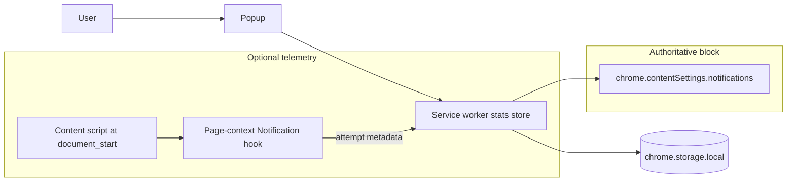
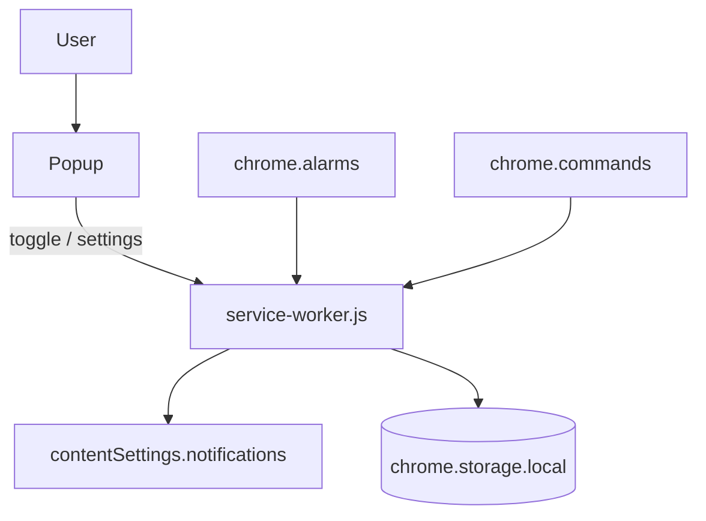
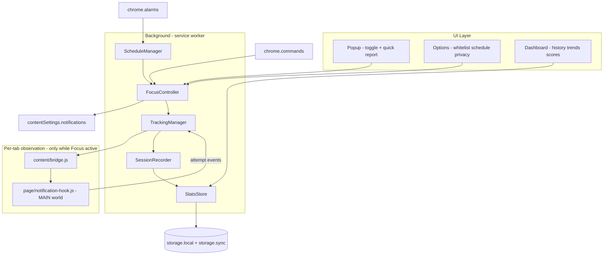
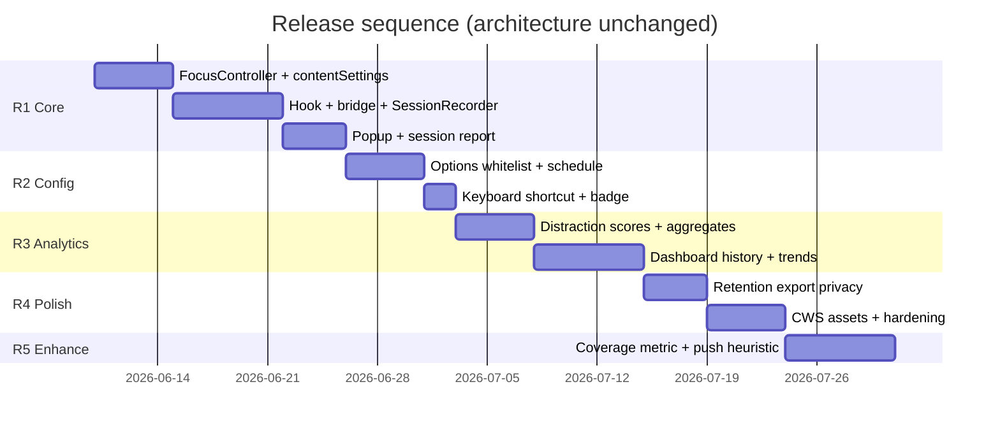

# Chrome extension for Focus Mode
_Exported on 10/06/2026 at 16:50:45 GMT+5 from Cursor (3.3.30)_

---

**User**

I want to build a Chrome extension that allows users to enable Focus Mode with a single click from the browser toolbar. When Focus Mode is enabled, all browser notification popups and push notifications should be blocked so the user can work without interruptions from websites. When Focus Mode is disabled, the extension should display a session summary showing the total number of notifications blocked, the websites that attempted to send notifications, and any useful statistics about distractions during the session. Additional features I would like to consider include automatically scheduling Focus Mode during specific hours each day, providing a per-domain distraction score that measures how aggressively each site attempted to interrupt the user, supporting a keyboard shortcut to toggle Focus Mode without opening the extension, and maintaining a whitelist of websites whose notifications should never be blocked. The intended user flow is simple: click the toolbar icon, activate Focus Mode, work without interruptions while notifications are blocked, deactivate Focus Mode, and then review the session report. My initial idea is to build the extension using JavaScript and Chrome Extension Manifest V3. I am considering creating a simple popup interface with a toggle button and a settings page where users can enable or disable Focus Mode, configure schedules, manage whitelisted websites, and view statistics and session reports. Please review this approach and determine whether the implementation is technically feasible, whether Chrome APIs allow notification blocking and tracking in the way described, what limitations or challenges should be considered, and whether there is a better architecture or implementation approach that would be recommended before development begins.


---

**Cursor**

Reviewing your Focus Mode concept against Chrome Extension MV3 capabilities and checking whether the repo already has related work.


Your overall direction is sound: a Manifest V3 extension with a toolbar popup, a service worker, and an options page is the right shape for this product. The important nuance is that **blocking** and **tracking** are not equally well supported by Chrome — blocking is reliable; rich session analytics are only partially achievable.

## Verdict: Feasible, with clear limits on statistics

Focus Mode as a **notification blocker** is technically feasible with MV3. Focus Mode as a **complete distraction analytics tool** is feasible only if you scope statistics honestly and accept gaps, especially for service-worker push notifications.

Your proposed stack fits well:

| Component | Role |
|---|---|
| MV3 service worker | Focus state, scheduling, keyboard shortcut, `contentSettings` |
| Toolbar popup | One-click toggle + quick session view |
| Options page | Schedule, whitelist, history |
| `chrome.storage` | Session stats, settings, snapshots |

---

## How blocking actually works in Chrome

Chrome does **not** expose a “intercept every notification” event. The reliable mechanism is **`chrome.contentSettings.notifications`**, which controls whether sites may use the Notifications API and Web Push at the browser permission layer.

According to Chromium’s notification permission context, this setting guards:

- The page `Notification` API  
- Web Push / service worker `showNotification()`  
- (Separately) extension `chrome.notifications` for extensions that declare that permission  

For Focus Mode, your core toggle would:

1. **Enable:** set a broad block rule (e.g. `*://*/*` → `block`), plus `allow` rules for whitelisted domains (more specific patterns win).
2. **Disable:** `chrome.contentSettings.notifications.clear()` to remove **your extension’s** rules and restore the user’s normal Chrome notification settings.

That gives you real blocking for sites that already have notification permission, which is the main interruption case users care about.

**What this does not block:**

- Notifications from **other installed extensions** (unless you add separate logic; most focus extensions don’t).
- **Native OS/app notifications** (Slack desktop, mail clients, etc.).
- Browser UI that isn’t a web notification (some sites use in-page toasts instead).

Set expectations in the UI: “Blocks website notification popups in Chrome,” not “blocks all distractions.”

---

## Tracking blocked notifications: the hard part

There is **no Chrome API** that fires when the browser silently blocks a notification. Session stats require a **second layer** on top of `contentSettings`.

### Recommended hybrid architecture



1. **`contentSettings`** — source of truth for blocking (including service worker push).
2. **Page-context script injection** — intercept `window.Notification` in the **page’s JavaScript world** (not the content-script isolated world) to count attempts, origins, and timestamps.

Content scripts alone cannot override `Notification` for the page; you need injection via a `web_accessible_resources` script or equivalent page-world hook, injected as early as possible (`document_start`, `all_frames: true`).

### What you can count reliably

| Source | Blockable? | Countable? |
|---|---|---|
| In-page `new Notification()` | Yes | Yes (with page hook) |
| Service worker push + `showNotification()` | Yes (via permission block) | **Mostly no** — push handling runs in the site’s SW, not your extension |
| Permission prompts (`Notification.requestPermission`) | Can be blocked indirectly | Partially — you can log prompt attempts in hooked pages |
| Already-delivered notifications before Focus Mode | N/A | No retroactive data |

**Practical implication:** Session reports should emphasize **“notification attempts observed”** rather than claiming a complete count of every blocked popup. A honest summary might look like:

- Total blocked attempts (observed)  
- Per-domain counts  
- Distraction score (derived from observed data)  
- Footnote: “Push notifications from background tabs may not appear in this count”  

For the **distraction score**, a simple v1 formula works well:

```
score(domain) = observed_attempts × weight
                 + (attempts_per_minute × time_weight)
```

Store **domain + count + timestamps only** — not notification titles/bodies (privacy and Chrome Web Store review sensitivity).

### CSP and coverage gaps

On sites with strict `Content-Security-Policy`, injected page scripts may fail. **`contentSettings` still blocks**; **stats will under-count** on those sites. That’s expected, not a bug in your design.

---

## Your extra features: API fit

| Feature | Feasible? | Notes |
|---|---|---|
| Toolbar one-click toggle | Yes | `chrome.action` + popup |
| Session summary on disable | Yes | Aggregate from `chrome.storage` |
| Scheduled Focus Mode | Yes | `chrome.alarms` in the service worker; re-check schedule on startup |
| Keyboard shortcut | Yes | `commands` in manifest (e.g. `Ctrl+Shift+F`) |
| Per-domain whitelist | Yes | More specific `allow` patterns override global `block` |
| Distraction score | Yes (partial data) | Based on observed attempts; label limitations clearly |
| Restore user settings after session | Yes | `contentSettings.clear()` removes extension rules; don’t mutate user rules in Chrome settings UI |

**Scheduling detail:** MV3 service workers suspend. Use `chrome.alarms` (not `setInterval`) and handle `alarms.onAlarm`, plus an startup hook to catch missed windows after browser restart.

**Whitelist detail:** Pattern precedence is hostname → scheme → port. Use explicit patterns like `https://mail.google.com/*` rather than loose globs when possible.

---

## Challenges to plan for before building

1. **Statistics vs. blocking mismatch** — Blocking is browser-level; counting is page-level. Design the product around that gap.
2. **No enumeration of all site permissions** — You can’t easily snapshot “every site’s notification setting” before a session. Extension-layer rules + `clear()` is the safe model; avoid writing global Chrome prefs directly.
3. **Incognito** — Separate scope (`incognito_session_only` vs `regular`); decide whether Focus Mode applies there and disclose in the listing.
4. **Host permissions** — Injection for stats needs broad host access (`<all_urls>` or optional host permissions). That affects Web Store review and user trust; consider making deep stats opt-in.
5. **Permission UX** — `contentSettings` is powerful; explain clearly that the extension changes notification permissions while Focus Mode is on.
6. **Race on toggle** — Apply `contentSettings` in the service worker before showing “Focus Mode active” in the popup to avoid a brief leak window.
7. **Cross-browser** — This design is Chrome-centric; Firefox/Safari differ significantly.

---

## Recommended architecture (before coding)

```
focus-mode-extension/
├── manifest.json
├── background/
│   └── service-worker.js      # state, contentSettings, alarms, commands
├── popup/
│   ├── popup.html
│   └── popup.js               # toggle + last session snippet
├── options/
│   ├── options.html
│   └── options.js             # schedule, whitelist, history
├── content/
│   └── bridge.js              # inject hook, relay messages
├── page/
│   └── notification-hook.js   # page-world Notification override
└── lib/
    ├── focus-controller.js    # enable/disable + rule management
    ├── stats.js               # session aggregation
    └── schedule.js            # alarm logic
```

**Design principles:**

1. **`contentSettings` = enforcement** — always on when Focus Mode is active.  
2. **Page hook = telemetry** — best-effort, not guaranteed complete.  
3. **Session model** — `{ sessionId, startedAt, endedAt, byDomain: { [host]: { attempts, score } } }`.  
4. **Disable flow** — clear rules → finalize session → show summary in popup or options.  
5. **v1 scope** — block web notifications + observed-attempt stats; defer “block all extensions” and “block in-page toasts” to later.

---

## Is there a better approach?

For a Chrome extension, **no fundamentally better option** exists today:

- **`declarativeNetRequest`** — network requests, not notifications.  
- **`webRequest` blocking** — largely unavailable in MV3 for this use case.  
- **Only page injection, no `contentSettings`** — stats without reliable SW push blocking.  
- **Only `contentSettings`, no injection** — strong blocking, weak or empty session reports.

The hybrid model above is what similar “focus / block notifications” extensions use in practice.

**Alternative product angles** (optional later, not replacements):

- **Quiet hours only** — schedule without full “session report” UX (simpler v1).  
- **Permission hygiene** — on disable, suggest revoking notification permission for top offenders (links to `chrome://settings/content/notifications`).  
- **Pair with OS Focus** — document that Chrome Focus Mode complements, not replaces, macOS/Windows Do Not Disturb.

---

## Suggested v1 scope

Ship first with:

1. Toolbar toggle + keyboard shortcut  
2. `contentSettings`-based blocking + whitelist  
3. Session summary: total observed attempts, top domains, session duration  
4. Optional schedule in options  

Defer or label as beta:

- “Complete” push notification counts  
- Aggressive distraction scoring  
- Blocking other extensions’ notifications  

---

## Clarifications before implementation

A few decisions will shape the build:

1. **Statistics strictness** — Is “observed attempts with known gaps” acceptable for v1, or do you need push-level accuracy (which would require narrowing scope or setting expectations)?  
2. **Incognito** — Should Focus Mode apply in private windows?  
3. **Host permissions** — Full `<all_urls>` for stats at install time, or optional “enhanced statistics” permission?  
4. **Whitelist defaults** — Any domains pre-whitelisted (e.g. calendar/work tools)?  

If you want to proceed, I can next draft the `manifest.json`, service worker focus controller, and the minimal popup/options flow aligned with this architecture.

---

**User**

I want to keep the MVP extremely simple. The core goal is to block browser notifications during a focus session with a single click. I am not convinced we need page injection, telemetry hooks, distraction scores, advanced analytics, or multiple management screens in the first version.

Can you redesign the architecture around the simplest possible implementation that:

Enables Focus Mode with one click
Blocks browser notifications reliably
Allows a whitelist
Optionally supports scheduled focus sessions
Shows a simple session summary when Focus Mode ends

Please remove anything that is not essential for the MVP and explain the tradeoffs.

---

**Cursor**

Here is an MVP architecture stripped down to what Chrome can do **without** page injection or telemetry.

## MVP principle

Use **`chrome.contentSettings.notifications` as the only enforcement mechanism.** Everything else is state you store yourself (on/off, times, whitelist, session start/end).

That gives you reliable blocking with very little code. It also means the session summary **cannot** include “X notifications blocked” or per-site attempt lists — Chrome does not expose that without hooks you explicitly want to drop.

---

## What the MVP includes

| Feature | How |
|---|---|
| One-click Focus Mode | Toolbar popup toggle |
| Block web notifications | Global `block` rule via `contentSettings` |
| Whitelist | Per-domain `allow` rules (more specific than global block) |
| Optional schedule | `chrome.alarms` to auto start/stop |
| Session summary | Duration + status message when session ends |

## What the MVP removes

| Removed | Why |
|---|---|
| Page-context injection | Only needed for counting attempts |
| Content scripts | No telemetry in v1 |
| Distraction scores / analytics | Depend on injection |
| Separate options/history pages | Settings live in the popup |
| `host_permissions` / `<all_urls>` | Not needed without injection |

---

## Minimal file structure

```
focus-mode/
├── manifest.json
├── service-worker.js    # all background logic
├── popup.html
├── popup.js
└── icons/
```

Four functional files. No `content/`, no `page/`, no `options/`.

---

## Architecture



**Single service worker** owns:

1. Focus on/off state  
2. Applying/clearing notification rules  
3. Session timestamps  
4. Schedule alarms  
5. Toolbar icon/badge (e.g. “ON”)  

**Popup** is the only UI: toggle, whitelist editor, optional schedule fields, and the end-of-session summary.

---

## Core logic (conceptual)

### Enable Focus Mode

```javascript
// 1. Record session start
await chrome.storage.local.set({ focusActive: true, sessionStartedAt: Date.now() });

// 2. Block all sites
await chrome.contentSettings.notifications.set({
  primaryPattern: '*://*/*',
  setting: 'block',
});

// 3. Allow whitelisted domains (more specific patterns win)
for (const domain of whitelist) {
  await chrome.contentSettings.notifications.set({
    primaryPattern: `*://${domain}/*`,
    setting: 'allow',
  });
}
```

### Disable Focus Mode

```javascript
// 1. Clear only this extension's rules — user's normal Chrome settings return
await chrome.contentSettings.notifications.clear({ scope: 'regular' });

// 2. Finalize session
const endedAt = Date.now();
// compute duration from sessionStartedAt → show in popup

await chrome.storage.local.set({
  focusActive: false,
  lastSession: { startedAt, endedAt, durationMs },
});
```

### Whitelist

- Store an array of hostnames in `chrome.storage.local` (e.g. `["calendar.google.com"]`).
- On enable (and when whitelist changes while active), re-apply allow rules.
- No separate management screen — a small text input + list in the popup is enough.

### Schedule (optional, still simple)

- Store `{ enabled, startHour, startMinute, endHour, endMinute }` in storage.
- Create daily `chrome.alarms` for start and end.
- On alarm: call the same enable/disable functions as the manual toggle.
- On service worker startup: re-register alarms if schedule is enabled.

### Keyboard shortcut (optional, low cost)

Add one `commands` entry in the manifest. Same enable/disable path as the popup — no extra architecture.

---

## Session summary (honest MVP version)

When the user turns Focus Mode off, show something like:

```
Focus session complete

Duration: 1h 23m
Notifications: blocked for all sites except whitelist
Whitelisted: calendar.google.com
```

**Not in MVP:**

- “47 notifications blocked”
- “Top distracting sites”
- Attempt timestamps

Those require injection or a browser API that does not exist. For v1, frame the summary as **session time protected**, not **events intercepted**.

If you want a single numeric stat without injection, the only honest option is **duration** (and maybe **whitelist count**). Do not imply a blocked-notification count.

---

## Popup layout (one screen)

```
┌─────────────────────────────┐
│  Focus Mode          [ ON ] │  ← main toggle
│                             │
│  ── After session ends ──   │  ← shown when turning off
│  Duration: 45m              │
│  Notifications were blocked │
│                             │
│  Whitelist                  │
│  [ add domain... ] [Add]    │
│  • calendar.google.com  ✕   │
│                             │
│  Schedule (optional)        │
│  [ ] Auto Focus 9:00–17:00  │
└─────────────────────────────┘
```

No tabs, no options page, no stats dashboard.

---

## `manifest.json` (minimal permissions)

```json
{
  "manifest_version": 3,
  "name": "Focus Mode",
  "version": "0.1.0",
  "permissions": ["contentSettings", "storage", "alarms"],
  "background": { "service_worker": "service-worker.js" },
  "action": { "default_popup": "popup.html" },
  "commands": {
    "_execute_action": { "suggested_key": { "default": "Ctrl+Shift+F" } }
  }
}
```

No `host_permissions`. No `content_scripts`. No `web_accessible_resources`.

---

## Tradeoffs

### 1. No blocked-notification count

**Tradeoff:** Session summary is time-based, not event-based.  
**Benefit:** ~70% less code, no CSP issues, no broad host access, easier Web Store review.  
**Mitigation later:** Add optional “enhanced stats” with page injection as v2, clearly labeled.

### 2. Service worker push is blocked, but invisible

**Tradeoff:** Push from background tabs is blocked reliably via `contentSettings`, but you never know it happened.  
**Benefit:** Blocking still works; you just don’t report it.  
**User messaging:** “Website notifications were blocked” — accurate without claiming a number.

### 3. Whitelist is hostname-based only

**Tradeoff:** Users enter domains like `mail.google.com`, not full URL patterns.  
**Benefit:** Simple mental model and simple UI.  
**Edge case:** Subdomains need separate entries unless you document `*.example.com`-style patterns.

### 4. Schedule is time-of-day, not calendar-aware

**Tradeoff:** Alarms fire at fixed daily times; no “weekdays only” unless you add that later.  
**Benefit:** Two alarms, one storage object — enough for MVP.

### 5. Extension rules vs user settings

**Tradeoff:** While Focus Mode is on, your extension overlays Chrome’s notification rules. `clear()` on disable restores prior behavior.  
**Benefit:** No need to read or snapshot every site permission (Chrome doesn’t expose a list API anyway).  
**Risk:** If the extension crashes mid-session, stale rules could linger — handle `chrome.runtime.onStartup` to reconcile state from storage.

### 6. Other extensions’ notifications still show

**Tradeoff:** Only **website** notifications are affected.  
**Benefit:** Avoids fighting other extensions and extra permissions.  
**Worth one line in the popup:** “Blocks website notifications in Chrome.”

---

## Recommended v1 scope lock

**Ship:**

- Popup toggle  
- `contentSettings` block + whitelist  
- Duration-based session summary  
- Optional daily schedule  
- Optional keyboard shortcut  

**Explicitly defer:**

- Blocked notification counts  
- Per-site attempt lists  
- Distraction scores  
- Page injection  
- Options/history pages  
- Incognito support (add later with `incognito_session_only` if needed)  

---

## Implementation order

1. Service worker: enable/disable + `contentSettings` + storage  
2. Popup: toggle wired to service worker  
3. End-of-session summary (duration only)  
4. Whitelist add/remove + re-apply rules  
5. Schedule via `alarms`  
6. Icon badge + keyboard shortcut  

That is a small, shippable MVP: one click, reliable blocking, whitelist, optional schedule, honest summary.

If you want to move forward, I can scaffold this four-file extension in your repo next.

---

**User**

I want the complete product, not a reduced MVP.

The notification summary and per-site statistics are core features of the product, not optional features. The value proposition is not only blocking notifications, but also showing users how many interruptions were prevented and which websites were responsible.

Please redesign the architecture to support the following complete feature set:

Core Features:

* One-click Focus Mode activation from the Chrome toolbar.
* Block website notification popups and push notifications while Focus Mode is active.
* Track notification attempts whenever technically possible.
* Display a session report when Focus Mode is disabled.
* Show total blocked or observed notification attempts.
* Show which domains generated those attempts.
* Show session duration.

Additional Features:

* Daily scheduling of Focus Mode.
* Keyboard shortcut to enable or disable Focus Mode.
* Domain whitelist.
* Per-domain distraction score.
* Historical session data.
* Dashboard showing focus trends over time.

I understand Chrome has technical limitations around notification tracking. Instead of removing these features, I want the architecture to maximize data collection within Chrome's limitations and clearly label any metrics as "observed attempts" where necessary.

Please propose the best architecture to support the full product, including:

* Service worker
* Popup UI
* Options page
* Dashboard/history page
* Content scripts
* Notification tracking strategy
* Data storage strategy
* Privacy considerations
* Chrome Web Store compliance considerations

Do not optimize for the smallest MVP. Optimize for delivering the complete product vision while remaining technically feasible in Chrome.


---

**Cursor**

# Focus Mode — Full Product Architecture

This design targets the complete product: reliable blocking, maximum observable telemetry within Chrome’s limits, session reports, distraction scoring, history, and a trends dashboard. It deliberately does **not** shrink scope; it layers **enforcement**, **observation**, and **presentation** so each can evolve independently.

---

## Product model (honest metrics)

Chrome has no `onNotificationBlocked` API. The architecture uses two parallel paths:

| Layer | Role | Coverage |
|---|---|---|
| **Enforcement** | `chrome.contentSettings.notifications` | Blocks page `Notification`, permission grants, and service-worker push display |
| **Observation** | Page-world hook + content-script bridge | Counts attempts that execute JavaScript in a tab you can inject into |

**User-facing language:**

- **“Observed attempts”** — counted via the hook (in-page `Notification`, `requestPermission`, etc.)
- **“Blocked by Focus Mode”** — inferred: observed attempts during an active session are treated as blocked (hook prevents display when Focus Mode is on)
- **“Estimated push (not observed)”** — optional future enhancement; not counted in v1 totals unless you add heuristics

Never claim “every notification Chrome blocked” unless you label gaps. The UI should include a short “How we measure” explainer on the dashboard.

---

## High-level architecture



---

## Repository structure

```
focus-mode/
├── manifest.json
├── background/
│   └── service-worker.js          # orchestrator; thin entry
├── lib/
│   ├── focus-controller.js        # enable/disable, contentSettings rules
│   ├── tracking-manager.js        # register scripts, aggregate attempts
│   ├── session-recorder.js        # session lifecycle + finalization
│   ├── stats-store.js             # persistence, queries, retention
│   ├── schedule-manager.js        # daily alarms
│   ├── distraction-score.js       # scoring formulas
│   └── constants.js
├── content/
│   └── bridge.js                  # inject hook, relay messages to SW
├── page/
│   └── notification-hook.js       # MAIN world Notification override
├── popup/
│   ├── popup.html
│   ├── popup.css
│   └── popup.js
├── options/
│   ├── options.html
│   ├── options.css
│   └── options.js
├── dashboard/
│   ├── dashboard.html
│   ├── dashboard.css
│   └── dashboard.js
└── icons/
```

---

## Component responsibilities

### 1. Service worker (orchestrator)

Single MV3 service worker owns all authoritative state.

**Modules:**

| Module | Responsibility |
|---|---|
| `FocusController` | Toggle Focus Mode; apply/clear `contentSettings`; sync badge/icon |
| `TrackingManager` | Register/unregister content scripts; receive attempt events; debounce writes |
| `SessionRecorder` | Start/end sessions; build session report payload |
| `ScheduleManager` | Daily start/stop alarms; reconcile on browser startup |
| `StatsStore` | Read/write sessions, aggregates, settings |

**Events handled:**

- `chrome.runtime.onMessage` — toggle, stats queries, settings updates
- `chrome.alarms.onAlarm` — scheduled focus windows
- `chrome.commands.onCommand` — keyboard toggle
- `chrome.runtime.onStartup` / `onInstalled` — restore state, re-apply rules if session was active
- `chrome.storage.onChanged` — whitelist/schedule updates while active

**Focus Mode ON sequence:**

1. Persist `focusActive: true`, `sessionStartedAt`
2. Apply global `block` + whitelist `allow` rules via `contentSettings`
3. Register dynamic content scripts on `<all_urls>` (all frames, `document_start`)
4. Inject hook into already-open tabs via `chrome.scripting.executeScript` (`world: 'MAIN'`)
5. Initialize in-memory session counters

**Focus Mode OFF sequence:**

1. Unregister content scripts
2. `contentSettings.notifications.clear()`
3. Finalize session → compute scores → persist to history
4. Persist `focusActive: false`, `lastSessionReport`
5. Notify popup/dashboard if open

---

### 2. Popup UI

**Purpose:** Primary control surface; not a settings hub.

**Contents:**

- Large Focus Mode toggle (primary action)
- Status: “Active · 42m” with live timer
- On disable: inline **session report**
  - Duration
  - Total **observed** attempts (with ℹ️ tooltip)
  - Top 3 domains by attempts
  - Link: “View full report → Dashboard”
- Footer links: Options · Dashboard

Keep popup small (~320×400px). No charts here.

---

### 3. Options page

**Purpose:** Configuration and privacy controls.

**Sections:**

| Section | Settings |
|---|---|
| **Whitelist** | Add/remove domains; import/export list |
| **Schedule** | Enable daily window; start/end time; weekdays-only (optional) |
| **Shortcuts** | Link to `chrome://extensions/shortcuts` |
| **Tracking** | Explain observation model; toggle “Track permission prompts” (on by default) |
| **Data & privacy** | Export JSON, delete all history, retention period (30/90/365 days) |
| **About** | “How metrics work”, privacy policy link |

---

### 4. Dashboard / history page

**Purpose:** Long-term value — trends, scores, session drill-down.

Full extension page (`chrome-extension://…/dashboard/dashboard.html`).

**Views:**

1. **Overview**
   - Total focus time (7d / 30d / all)
   - Total observed attempts blocked
   - Average attempts per session
   - Top distracting domains (bar chart)
   - Focus minutes per day (line chart)

2. **Sessions**
   - Sortable table: date, duration, observed attempts, top domain
   - Click → session detail panel

3. **Domains**
   - Per-domain: cumulative attempts, sessions seen, **distraction score**
   - Sort by score or attempt count

4. **Session detail**
   - Timeline of attempt buckets (e.g. per 15 min, not individual titles)
   - Domain breakdown table
   - Score breakdown explanation

Use lightweight charting (Chart.js or plain SVG/canvas) — no external CDN scripts (CWS compliance).

---

## Notification tracking strategy

### Enforcement (100% of blockable web notifications)

```javascript
// Global block while Focus Mode active
await chrome.contentSettings.notifications.set({
  primaryPattern: '*://*/*',
  setting: 'block',
});

// Whitelist overrides (more specific pattern wins)
for (const host of whitelist) {
  await chrome.contentSettings.notifications.set({
    primaryPattern: `*://${host}/*`,
    setting: 'allow',
  });
}
```

This blocks:

- In-page `new Notification()`
- `Notification.requestPermission()` outcomes (blocked at permission layer)
- Service worker `registration.showNotification()` / Web Push display

Whitelisted domains remain allowed.

### Observation (maximize within Chrome limits)

**Only while Focus Mode is active** — scripts register on enable, unregister on disable. Good for performance, privacy narrative, and CWS justification.

#### A. Dynamic content script (`content/bridge.js`)

Registered via `chrome.scripting.registerContentScripts`:

- `matches: ['<all_urls>']`
- `runAt: 'document_start'`
- `allFrames: true`

Bridge responsibilities:

1. Inject `page/notification-hook.js` into **MAIN** world (page JS context)
2. Listen for `postMessage` / custom events from the hook
3. Forward `{ type: 'attempt', domain, kind, timestamp }` to service worker

Prefer `chrome.scripting.executeScript({ world: 'MAIN' })` for injection where available; fallback to `<script src="chrome-extension://…">` for frames.

#### B. Page-world hook (`page/notification-hook.js`)

Wrap, do not replace with arrow functions (constructors require `function`).

**Track:**

| Event | `kind` | Notes |
|---|---|---|
| `new Notification(...)` | `notification` | Increment counter; if Focus active, swallow display (return no-op object or throw silently) |
| `Notification.requestPermission()` | `permission_request` | Log attempt even if blocked by contentSettings |
| `ServiceWorkerRegistration.prototype.showNotification` (if reachable from page) | `show_notification` | Rare from page context; best-effort |

**Do not store:** notification title, body, icon URL (privacy).

**Payload sent upstream:**

```javascript
{
  type: 'NOTIFICATION_ATTEMPT',
  host: location.hostname,      // not full URL path
  kind: 'notification',         // enum
  timestamp: Date.now(),
  frame: window === window.top   // top vs iframe
}
```

#### C. Service worker aggregation

Avoid writing to storage on every attempt (performance + quota).

```javascript
// In-memory during session
sessionBuffer.byDomain[host] = {
  observedAttempts: 0,
  permissionRequests: 0,
  iframeAttempts: 0,
  firstAt, lastAt
};

// Flush to storage.local every 30s + on disable
```

#### D. Known gaps (document in UI)

| Scenario | Blocked? | Observed? |
|---|---|---|
| In-page `Notification()` | Yes | Yes (if inject succeeds) |
| SW push → `showNotification()` | Yes | **No** (runs in site SW, not injectable) |
| Strict CSP pages | Yes | **No** (hook injection may fail) |
| Whitelisted domain | No | Yes (allowed through; still counted as “allowed attempt” separately) |
| Other extensions’ notifications | No | No |

**Dashboard copy example:**

> “Observed attempts: 23 — counts notification API usage we could detect in open tabs. Background push notifications may be blocked but not counted.”

Optional v1.1 heuristic (clearly labeled **estimated**): if a tab with notification permission is backgrounded and domain has historical SW push patterns, do not implement unless you can defend accuracy — skip for launch.

---

## Distraction score

Computed at session end and updated in domain aggregates. Based on **observed** data only.

**Per-domain session score:**

```text
raw = (notificationAttempts × 10)
    + (permissionRequests × 3)
    + (iframeAttempts × 2)

rate = raw / max(sessionMinutes, 1)
sessionScore = min(100, round(rate × 8 + log2(observedAttempts + 1) × 5))
```

**Global domain score (dashboard):**

```text
domainScore = weighted average of sessionScores
              + 0.1 × totalHistoricalObservedAttempts (capped)
```

Show as 0–100 with labels: Low (0–25), Moderate (26–50), High (51–75), Very High (76–100).

Include “Score based on observed attempts” on every score display.

---

## Data storage strategy

### `chrome.storage.sync` (settings, small)

```javascript
{
  whitelist: string[],
  schedule: {
    enabled: boolean,
    start: "09:00",
    end: "17:00",
    days: [1,2,3,4,5]  // Mon–Fri
  },
  retentionDays: 90,
  trackPermissionRequests: true
}
```

Stay under ~100KB sync quota.

### `chrome.storage.local` (sessions + aggregates)

```javascript
{
  focusActive: boolean,
  currentSessionId: string,
  sessionStartedAt: number,

  // Rolling buffer (flushed periodically)
  liveBuffer: { byDomain: {...}, totalObserved: number },

  // Last completed (for popup)
  lastSessionReport: SessionReport,

  // History index (last N session IDs)
  sessionIndex: string[],  // newest first, max 500

  // Session documents keyed by ID
  sessions: {
    [sessionId]: {
      id, startedAt, endedAt, durationMs,
      totalObservedAttempts,
      byDomain: {
        [host]: {
          observedAttempts,
          permissionRequests,
          distractionScore,
          allowed: boolean  // was whitelisted
        }
      },
      source: 'manual' | 'scheduled'
    }
  },

  // Precomputed aggregates for dashboard
  aggregates: {
    daily: { "2026-06-10": { focusMinutes, observedAttempts } },
    domains: { [host]: { totalAttempts, totalScore, sessionCount } }
  }
}
```

### Retention & quota

- `chrome.storage.local` default quota ~10MB (request `"unlimitedStorage"` only if you routinely exceed it)
- Prune sessions older than `retentionDays` on each session finalize
- Rebuild `aggregates` from remaining sessions on prune (or incrementally update)

### Future scale (if needed)

Move `sessions` + `aggregates` to **IndexedDB** when history exceeds ~5MB. Keep sync settings in `storage.sync`. Abstract behind `StatsStore` so UI doesn’t change.

---

## Session report (on disable)

**Popup + dashboard detail share the same `SessionReport` object:**

```javascript
{
  durationMs: 3720000,
  durationLabel: "1h 2m",
  totalObservedAttempts: 23,
  metricsLabel: "Observed attempts",
  topDomains: [
    { host: "slack.com", attempts: 12, score: 68, allowed: false },
    { host: "news.ycombinator.com", attempts: 7, score: 41, allowed: false }
  ],
  whitelistedDomains: ["calendar.google.com"],
  startedAt, endedAt,
  disclaimer: "Push notifications from background tabs may be blocked but not included in this count."
}
```

---

## Scheduling

`ScheduleManager` using `chrome.alarms`:

- `focus-start` — daily at configured time (respect `days`)
- `focus-end` — daily at end time
- On alarm: call `FocusController.enable({ source: 'scheduled' })` or `.disable()`
- On startup: if current time falls inside window and schedule enabled, ensure Focus Mode is on
- If manual toggle conflicts with schedule, **manual wins until next boundary** (store `manualOverrideUntil`)

---

## Keyboard shortcut

```json
"commands": {
  "toggle-focus-mode": {
    "suggested_key": { "default": "Ctrl+Shift+F", "mac": "Command+Shift+F" },
    "description": "Toggle Focus Mode"
  }
}
```

`chrome.commands.onCommand` → same `FocusController.toggle()` as popup.

---

## Privacy considerations

| Principle | Implementation |
|---|---|
| **Local-first** | All session data in `storage.local`; no remote analytics by default |
| **Minimal collection** | Store hostname + counts + timestamps only; never title/body/icon |
| **Active-only tracking** | Content scripts registered only during Focus Mode |
| **Transparency** | Options + dashboard explain observation limits |
| **User control** | Export, delete all data, configurable retention |
| **Whitelist clarity** | Whitelisted domains may still show notifications; attempts logged separately as “allowed” |

**Privacy policy (required):** State that the extension accesses browsing activity (hostnames of pages where notification APIs are invoked) **only during Focus Mode**, stored locally, not sold or transmitted.

---

## Chrome Web Store compliance

| Requirement | Approach |
|---|---|
| **Single purpose** | “Block website notifications and report interruption attempts during focus sessions” |
| **Permission justification** | `contentSettings` — block notifications; `<all_urls>` + `scripting` — observe API usage during focus only |
| **Host permissions** | Request at install for full product; justify in listing: “Required to detect notification attempts on websites during Focus Mode” |
| **Optional permissions** | Alternative: offer “basic mode” (block only, no stats) without host permissions — full stats require opt-in `permissions.request({ origins: ['<all_urls>'] })` |
| **No remote code** | All JS bundled; charts library vendored |
| **Data use disclosure** | Declare “browsing history” / “website content” carefully — you access **hostnames and API usage**, not page content |
| **Minimum permissions** | Do not request `tabs`, `webNavigation`, `history` unless needed; `scripting` + dynamic registration may suffice |
| **Incognito** | Decide explicitly; if supported, use `incognito: 'split'` and separate storage scope |

**Recommended manifest permissions:**

```json
{
  "permissions": [
    "contentSettings",
    "storage",
    "alarms",
    "scripting"
  ],
  "host_permissions": ["<all_urls>"],
  "optional_permissions": []
}
```

For CWS review, prepare a **short video** showing: toggle on → notification blocked on test site → disable → session report with counts.

---

## UI information architecture

```text
Toolbar icon
  └── Popup
        ├── Toggle Focus Mode
        ├── Live session status
        ├── End-of-session report (on disable)
        └── Links → Options | Dashboard

Options (chrome.runtime.openOptionsPage)
        ├── Whitelist
        ├── Schedule
        ├── Privacy & data
        └── How metrics work

Dashboard (chrome.tabs.create)
        ├── Overview (trends)
        ├── Sessions (history)
        └── Domains (scores)
```

---

## Tradeoffs (accepted for full product)

| Choice | Benefit | Cost |
|---|---|---|
| Hybrid enforcement + injection | Reliable block + rich stats where possible | More code, CSP gaps, host permissions |
| Track only during Focus Mode | Privacy + performance | No baseline “before focus” comparison |
| Observed attempts labeling | Honest, defensible metrics | Users may want “true blocked count” |
| Local storage + aggregates | Fast dashboard | Must implement retention/pruning |
| Dynamic script registration | Scripts absent when idle | Must re-inject on all open tabs at enable |

---

## Implementation phases (full product, not MVP cuts)

1. **Core loop** — FocusController, contentSettings, popup toggle, duration report  
2. **Tracking pipeline** — bridge + hook + SessionRecorder + observed counts  
3. **Session report** — domain breakdown in popup  
4. **Distraction score** — formulas + display  
5. **Options** — whitelist, schedule, privacy controls  
6. **Dashboard** — history, aggregates, charts  
7. **Hardening** — startup recovery, retention, CWS listing assets  

Each phase adds user-visible value; none removes the core stats vision.

---

## Summary

The full product rests on three pillars:

1. **`contentSettings`** — authoritative blocking (including push)  
2. **Page-world hook (active sessions only)** — maximum observable telemetry  
3. **`StatsStore` + dashboard** — sessions, scores, trends, with clear **“observed attempts”** labeling  

That is the best feasible architecture in Chrome MV3 for “block interruptions **and** show users what would have distracted them,” without pretending Chrome exposes complete notification telemetry.

If you want to proceed to implementation, the next step is scaffolding this structure in your repo with the service worker modules and tracking pipeline first, then popup report, then dashboard.

---

**User**

The architecture looks good and aligns with the product vision.
Before implementation, please answer the following:
Validate the Notification API hooking approach and identify any technical limitations.
Clearly define every metric that will appear in reports and dashboards, including observed attempts, blocked attempts, allowed attempts, and any estimated values.
Provide a recommended implementation roadmap showing what should be included in the first release versus later enhancements, without changing the architecture.

---

**Cursor**

Validating hooking details and Chrome API constraints so metric definitions and the release roadmap match what the browser actually supports.


Below is a pre-implementation validation: hooking approach, a precise metric dictionary, and a release roadmap that keeps the agreed architecture intact.

---

# 1. Notification API Hooking — Validation & Limitations

## Recommended approach (validated)

The hybrid model from the architecture is the correct one for Chrome MV3:

| Layer | Mechanism | Purpose |
|---|---|---|
| **Enforcement** | `chrome.contentSettings.notifications` | Authoritative block/allow (includes Web Push display) |
| **Observation** | MAIN-world hook + ISOLATED bridge | Count API usage where JavaScript runs in tabs |

### Injection stack (correct for MV3)

Use **two dynamically registered content scripts**, active only while Focus Mode is on:

```javascript
// 1. MAIN world — hook (must run first)
{
  id: 'focus-hook',
  js: ['page/notification-hook.js'],
  matches: ['<all_urls>'],
  runAt: 'document_start',
  world: 'MAIN',
  allFrames: true,
  matchOriginAsFallback: true,
}

// 2. ISOLATED world — bridge to service worker
{
  id: 'focus-bridge',
  js: ['content/bridge.js'],
  matches: ['<all_urls>'],
  runAt: 'document_start',
  allFrames: false, // top frame only for messaging (avoid duplicate counts)
}
```

**On Focus Mode enable**, also run `chrome.scripting.executeScript({ world: 'MAIN', injectImmediately: true })` on all open tabs to cover tabs mid-load before registration completes.

**Do not** rely on `<script src="chrome-extension://…">` injection as the primary path — it loads asynchronously and misses early calls. **Do** use `registerContentScripts` with `world: 'MAIN'` and `runAt: 'document_start'` (Chrome 102+).

### What the hook must wrap

| API surface | Observable from page? | Reliable? |
|---|---|---|
| `new Notification(title, options)` | Yes | **High** — primary signal |
| `Notification.requestPermission()` | Yes | **High** |
| `ServiceWorkerRegistration.prototype.showNotification` (page-initiated) | Partially | **Low** — does not catch SW-internal calls |
| Push → `self.registration.showNotification()` inside site SW | No | **Not observable** — separate execution context |
| Already-granted permission checks (`Notification.permission`) | Yes | **Low value** — not an interruption attempt |

### Hook implementation requirements

1. **Use a real `function`, not an arrow function**, as the `Notification` replacement (constructors cannot be arrow functions).
2. **Preserve the prototype chain and static properties**:

   ```javascript
   function WrappedNotification(title, options) { /* record + suppress or pass through */ }
   WrappedNotification.prototype = OriginalNotification.prototype;
   Object.defineProperty(WrappedNotification, 'name', { value: 'Notification' });
   WrappedNotification.requestPermission = OriginalNotification.requestPermission.bind(OriginalNotification);
   WrappedNotification.permission = OriginalNotification.permission; // read-only; re-sync if needed
   ```

3. **Communicate via `window.postMessage`** from MAIN world → ISOLATED bridge → `chrome.runtime.sendMessage`. Never call `chrome.*` from MAIN world.
4. **Sanitize inbound events** in the bridge (validate `event.source`, message shape, hostname format) — MAIN world is untrusted and pages can spoof messages.
5. **Suppress display during Focus Mode** for non-whitelisted domains inside the hook (return a no-op object or throw a `TypeError` matching browser behavior when permission is denied) **in addition to** `contentSettings` — defense in depth.

---

## Technical limitations (must accept and disclose)

### A. Service worker push (largest gap)

When a push arrives, the site’s service worker calls `self.registration.showNotification()`. Your extension **cannot inject into another origin’s service worker**. Prototype patching on `ServiceWorkerRegistration` in the page only catches calls made **from page JavaScript**, not from the SW push handler.

**Result:** Push notifications are **blocked** by `contentSettings` but usually **not counted** in observed metrics.

### B. Strict Content Security Policy (CSP)

Pages with restrictive `script-src` may still be blocked by `contentSettings`, but MAIN-world extension scripts registered via `registerContentScripts` generally run. Edge cases exist (e.g. some isolated contexts). Treat stats as **best-effort under-counting**.

### C. Race: page captures `Notification` before hook

If a page stores `const N = window.Notification` before your hook runs, subsequent `new N()` bypasses the hook.

**Mitigations:**
- `document_start` + `world: 'MAIN'`
- Re-apply hook on `DOMContentLoaded` (best-effort re-wrap)
- Accept residual under-counting; document it

### D. Page can detect or fight the hook

MAIN-world code is not isolated. Sites (or other extensions) can overwrite `window.Notification` after you. There is no fully tamper-proof client-side hook.

**Mitigation:** `contentSettings` remains authoritative for blocking regardless of hook tampering.

### E. iframes and cross-origin frames

- `allFrames: true` on the MAIN hook catches embedded same-origin and many cross-origin frames.
- Cross-origin iframe attempts should be attributed to **iframe hostname**, not top-level URL.
- `about:blank` / opaque origins: use `matchOriginAsFallback: true`; attribution may be `"unknown"` — bucket separately, do not guess.

### F. Whitelisted domains

Whitelisted sites **may show notifications**. The hook should still record attempts and mark them **allowed**, not blocked.

### G. Other extensions

`contentSettings` does not block other extensions’ `chrome.notifications`. Out of scope unless you add extension-specific logic later.

### H. Incognito

Requires explicit `incognito` manifest policy and separate storage scope. Defer to Release 2 unless required at launch.

### I. Double counting risk

Same site may call both `requestPermission()` and later `new Notification()`. These are **distinct event types** — count both, but report them separately to avoid implying “47 popups” when some were permission prompts.

---

## Validation verdict

| Claim | Valid? |
|---|---|
| Hook + `contentSettings` is the best feasible Chrome approach | **Yes** |
| Can reliably block push notifications | **Yes** (via `contentSettings`) |
| Can reliably count all blocked notifications | **No** |
| Can reliably count in-page Notification API usage | **Yes** (with caveats above) |
| Can estimate unobserved push with high accuracy | **No** (without labeled heuristics in a later release) |

The approach is **technically sound for the product vision** if all user-facing numbers use the metric definitions below and gaps are labeled, not hidden.

---

# 2. Metric Dictionary

Every number shown in popup, session report, options, or dashboard must map to one of these definitions.

## Global labeling rule

All attempt-based metrics carry the badge **“Observed”** unless explicitly marked **“Estimated”**. Recommended UI string:

> **Observed** — detected via the Notification API in open tabs during Focus Mode. Background push notifications may be blocked but not observed.

---

## Core attempt metrics (session + dashboard)

### `totalObservedAttempts`

| Field | Definition |
|---|---|
| **What** | Total notification-related API events recorded by the hook during the session |
| **Includes** | `notification` + `permission_request` event types (see subtypes) |
| **Excludes** | Push handled entirely inside a service worker; events on tabs where injection failed |
| **UI label** | “Observed attempts” |
| **Primary headline metric** | Yes |

---

### `observedNotificationAttempts` (subtype)

| Field | Definition |
|---|---|
| **What** | Calls to `new Notification(...)` intercepted by the hook |
| **UI label** | “Notification attempts (observed)” |
| **Notes** | Closest proxy to “popup would have appeared” for in-page notifications |

---

### `observedPermissionRequests` (subtype)

| Field | Definition |
|---|---|
| **What** | Calls to `Notification.requestPermission()` intercepted by the hook |
| **UI label** | “Permission requests (observed)” |
| **Notes** | Measures sites **asking** to interrupt later, not a displayed popup. Show separately so users do not confuse with popups. |

---

### `observedBlockedAttempts`

| Field | Definition |
|---|---|
| **What** | Observed attempts where `host ∉ whitelist` at time of event |
| **Formula** | `observedBlockedAttempts = count(events where allowed === false)` |
| **UI label** | “Blocked attempts (observed)” |
| **Tooltip** | “Notification API usage from non-whitelisted sites during Focus Mode. These notifications were prevented.” |
| **Important** | This is **not** total browser-level blocks — only observed ones |

---

### `observedAllowedAttempts`

| Field | Definition |
|---|---|
| **What** | Observed attempts where `host ∈ whitelist` at time of event |
| **Formula** | `observedAllowedAttempts = count(events where allowed === true)` |
| **UI label** | “Allowed attempts (observed)” |
| **Tooltip** | “Notification API usage from whitelisted sites. Notifications may have been shown.” |

---

### Identity check (must always hold)

```text
totalObservedAttempts = observedBlockedAttempts + observedAllowedAttempts
```

If subtypes are shown separately:

```text
totalObservedAttempts = observedNotificationAttempts + observedPermissionRequests
```

(both classifications should be stored per event so cross-tabulations are consistent)

---

## Session metrics

### `sessionDuration`

| Field | Definition |
|---|---|
| **What** | `endedAt − startedAt` for the focus session |
| **UI label** | “Focus duration” |
| **Format** | `1h 23m` |
| **Estimated?** | No — exact |

---

### `sessionStartedAt` / `sessionEndedAt`

| Field | Definition |
|---|---|
| **What** | ISO timestamps for session boundaries |
| **UI label** | “Started / Ended” |
| **Estimated?** | No |

---

### `sessionSource`

| Field | Definition |
|---|---|
| **What** | `"manual"` \| `"scheduled"` \| `"shortcut"` |
| **UI label** | “Started via: Manual / Schedule / Shortcut” |
| **Estimated?** | No |

---

### `uniqueDomainsObserved`

| Field | Definition |
|---|---|
| **What** | Count of distinct hostnames with ≥1 observed attempt in the session |
| **UI label** | “Sites with observed activity” |
| **Estimated?** | No (but incomplete w.r.t. push-only sites) |

---

### `topDomainsByObservedBlockedAttempts`

| Field | Definition |
|---|---|
| **What** | Ranked list of hosts by `observedBlockedAttempts` in session |
| **UI label** | “Top interrupting sites (observed)” |
| **Show** | Host, blocked count, distraction score |
| **Do not show** | Notification title/body |

---

## Per-domain metrics (session detail + Domains view)

For each `host`:

### `domainObservedBlockedAttempts`

Blocked observed attempts attributed to this host in the session (or aggregated across sessions on dashboard).

### `domainObservedAllowedAttempts`

Allowed observed attempts for whitelisted host.

### `domainObservedNotificationAttempts` / `domainObservedPermissionRequests`

Subtype breakdown per domain.

### `domainDistractionScore` (0–100)

| Field | Definition |
|---|---|
| **What** | Computed score from **observed blocked** activity only |
| **Formula (recommended)** | |

```text
raw = (domainObservedBlockedAttempts × 10)
    + (domainObservedPermissionRequests × 3)

rate = raw / max(sessionDurationMinutes, 1)

sessionDomainScore = min(100, round(rate × 8 + log2(domainObservedBlockedAttempts + 1) × 5))
```

| Field | Definition |
|---|---|
| **UI label** | “Distraction score (observed)” |
| **Bands** | 0–25 Low · 26–50 Moderate · 51–75 High · 76–100 Very high |
| **Estimated?** | No — derived exactly from observed inputs |
| **Disclaimer** | “Based on observed API usage, not all background push activity.” |

### `domainGlobalScore` (dashboard, cross-session)

```text
domainGlobalScore = min(100, round(
  weightedAvg(sessionDomainScore across sessions)
  + min(10, totalDomainObservedBlockedAttempts × 0.05)
))
```

**UI label:** “Overall distraction score (observed)”

### `domainSessionCount`

Number of focus sessions where this domain had ≥1 observed attempt.

### `domainAllowedStatus`

Whether host is currently whitelisted (configuration, not a session metric).

---

## Dashboard aggregate metrics

### `totalFocusTime`

Sum of `sessionDuration` over selected period (7d / 30d / all).

**Label:** “Total focus time”

### `sessionCount`

Number of completed focus sessions in period.

**Label:** “Focus sessions”

### `avgObservedBlockedAttemptsPerSession`

```text
sum(observedBlockedAttempts) / sessionCount
```

**Label:** “Avg. blocked attempts per session (observed)”

### `avgSessionDuration`

**Label:** “Avg. focus duration”

### `dailyFocusMinutes` (trend chart)

Focus minutes per calendar day.

### `dailyObservedBlockedAttempts` (trend chart)

Sum of `observedBlockedAttempts` per calendar day.

**Label:** “Daily blocked attempts (observed)”

### `topDomainsAllTime` / `topDomainsPeriod`

Ranked by cumulative `domainObservedBlockedAttempts`.

---

## Estimated / non-counted metrics (label clearly — do not present as exact)

These are **disclosure metrics**, not fabricated counts, unless noted as a later enhancement.

### `unobservedBlockedNotifications` — **Do not show as a number in Release 1**

| Field | Definition |
|---|---|
| **What** | Push (and other) blocks that occurred without hook observation |
| **Release 1** | Show **qualitative disclaimer only**, not a numeric estimate |
| **UI label** | “Additional notifications may have been blocked in the background (not observed)” |

### `estimatedPushGap` — **Release 3+ optional enhancement**

| Field | Definition |
|---|---|
| **What** | Heuristic estimate of unobserved push blocks |
| **Method (future)** | Domains with `Notification.permission === 'granted'` + active SW registration + historical blocked/observed ratio |
| **UI label** | **“Estimated background blocks”** with ⚠️ icon |
| **Accuracy** | Low–medium — must never be merged into `observedBlockedAttempts` |

### `protectionCoverage` — **Release 2 optional**

| Field | Definition |
|---|---|
| **What** | % of active focus time where at least one tab had successful hook injection |
| **UI label** | “Observation coverage (estimated)” |
| **Use** | Helps users understand stat completeness without fake attempt counts |

---

## Metrics explicitly NOT collected (privacy)

| Data | Policy |
|---|---|
| Notification title/body/icon | **Never stored** |
| Full page URLs (paths, query strings) | **Never stored** — hostname only |
| Page content | **Never accessed** |
| Cross-device sync of history | **Not in v1** — local only |

---

## Popup session report layout (metric mapping)

When Focus Mode turns off:

```
Focus session complete
──────────────────────
Focus duration                    1h 02m
Observed attempts (total)              23
  ├ Blocked (observed)                 19
  └ Allowed — whitelisted               4
Top sites (observed)
  1. slack.com          12 blocked   score 68
  2. github.com          4 blocked   score 31
ℹ Background push may have been blocked but not counted.
[View full report → Dashboard]
```

---

# 3. Implementation Roadmap

Same architecture throughout — releases differ by **which modules are built and wired**, not by redesign.



---

## Release 1 — Core product loop (first public release)

**Goal:** User can focus, notifications are blocked, session report shows observed stats with honest labeling.

| Included | Details |
|---|---|
| Service worker + `FocusController` | Enable/disable, state persistence, startup recovery |
| `contentSettings` blocking | Global block + whitelist allow rules |
| MAIN hook + ISOLATED bridge | `notification` + `permission_request` events |
| Dynamic script registration | Register on enable, unregister on disable |
| `SessionRecorder` | Session lifecycle, in-memory buffer, flush on disable |
| Popup | Toggle, live timer, end-of-session report |
| Core metrics | `sessionDuration`, `totalObservedAttempts`, `observedBlockedAttempts`, `observedAllowedAttempts`, subtypes, `topDomainsByObservedBlockedAttempts`, disclaimer |
| Minimal whitelist | Inline in popup (add/remove domain) |
| Toolbar badge | “ON” indicator |

| Deferred to later releases | Why |
|---|---|
| Options page | Popup whitelist sufficient initially |
| Dashboard | No history UI yet; only `lastSessionReport` in storage |
| Distraction scores | Needs stable event pipeline first |
| Scheduling | Alarms + conflict logic adds complexity |
| Historical aggregates | Depends on session store volume |
| Keyboard shortcut | Quick add, not blocking |
| Export/delete data | Needed before scale, not day one |
| `estimatedPushGap` | Requires heuristics + careful UX |

**Release 1 success criteria:** Block works on test sites; observed counts increment on `new Notification()` and `requestPermission()`; whitelisted domain shows allowed bucket; session report matches stored events ±0.

---

## Release 2 — Configuration & daily workflow

**Goal:** Habit formation — schedule, settings, shortcut.

| Included | Details |
|---|---|
| Options page | Whitelist management, schedule, “How metrics work” |
| `ScheduleManager` | Daily start/stop via `chrome.alarms`, weekday filter |
| Keyboard shortcut | `chrome.commands` toggle |
| Manual override rules | Manual toggle wins until next schedule boundary |
| Re-inject open tabs | Robust enable flow for all tabs |
| iframe attribution | `allFrames` hook, `unknown` bucket |
| Session list (basic) | Last 10 sessions in options (table only — not full dashboard) |

| Deferred | Why |
|---|---|
| Full dashboard charts | Release 3 |
| Distraction scores in UI | Release 3 (compute pipeline can start in R2 backend) |
| Incognito support | Separate policy + QA |
| `protectionCoverage` | Nice-to-have |

---

## Release 3 — Analytics & distraction scoring

**Goal:** Long-term value — trends, scores, history.

| Included | Details |
|---|---|
| `distraction-score.js` | Session + global domain scores |
| `StatsStore` aggregates | Daily rollups, domain lifetime stats |
| Dashboard page | Overview, Sessions, Domains tabs |
| Charts | Focus minutes/day, blocked attempts/day, top domains bar chart |
| Session detail view | Domain breakdown, subtype split, score explanation |
| Retention policy | 30/90/365-day prune |
| Export JSON / delete all data | Privacy controls |

| Deferred | Why |
|---|---|
| IndexedDB migration | Only if storage > ~5MB in testing |
| `estimatedPushGap` | Heuristic needs baseline data from real usage |
| Cross-device sync | Scope + privacy review |
| CSV export | JSON first |

---

## Release 4 — Production hardening & Chrome Web Store

**Goal:** Ship confidently to CWS.

| Included | Details |
|---|---|
| Startup/crash recovery | Reconcile `focusActive` + rules + script registration |
| Storage quota handling | Prune, aggregate rebuild, optional `unlimitedStorage` if justified |
| Privacy policy page | Hostname-only collection, active-session-only tracking |
| CWS listing assets | Screenshots, permission justification, demo video |
| Error telemetry (local) | Optional internal error log in storage — **no remote analytics by default** |
| Performance | Debounced writes, cap events/sec per tab |
| QA matrix | CSP sites, SW push sites, iframes, whitelist, schedule edge cases |

---

## Release 5 — Enhancements (same architecture, additive modules)

| Enhancement | Module | Notes |
|---|---|---|
| `protectionCoverage` metric | `tracking-manager.js` | Heartbeat from bridge when hook installs successfully |
| `estimatedPushGap` (optional toggle) | `push-estimator.js` | Off by default; clearly labeled Estimated |
| IndexedDB backend | `stats-store.js` adapter | Transparent to UI |
| Incognito split mode | `focus-controller.js` | `incognito: 'split'` |
| Weekday-only schedule exceptions | `schedule-manager.js` | Config extension |
| Domain import/export | Options | JSON list |
| Comparison trends | Dashboard | “−12% attempts vs prior 30 days” |

---

## Cross-release engineering order (within Release 1)

Even inside Release 1, build in this sequence to reduce rework:

1. **`FocusController`** + storage schema + `contentSettings` (blocking works, no stats)
2. **Hook + bridge** + event schema (log to service worker console)
3. **`SessionRecorder`** + metric aggregation (correct definitions before UI)
4. **Popup toggle + report** (wire to finalized metrics)
5. **Whitelist in popup**
6. **Badge + copy/disclaimers**

Do not build dashboard charts until event schema and metric identities are frozen — the dictionary above should be implemented as constants/enums in code (`lib/metrics.js`) from day one.

---

## Summary

| Question | Answer |
|---|---|
| Is hooking valid? | **Yes**, with MAIN-world `registerContentScripts` + `contentSettings` |
| Main limitation? | **Service worker push** is blocked but not observable |
| Headline metric? | **`observedBlockedAttempts`**, not “notifications blocked” |
| Allowed vs blocked? | Split by **whitelist membership at event time** |
| Estimated metrics? | **Disclaimer in R1–R3**; numeric estimates only in **R5+**, opt-in, separately labeled |
| First release scope? | **Block + observe + popup report + whitelist** — no dashboard yet |
| Architecture change? | **None** across releases — only module completion |

If you want to move to implementation next, the first concrete step is scaffolding `lib/metrics.js` (metric definitions as code), `FocusController`, and the dual content-script registration path — that locks the data contract before any UI work.

---

**User**

The architecture roadmap look good.

Let's proceed with implementation.

---

**Cursor**

Implementing Release 1: core service worker, tracking pipeline, and popup. Scaffolding the extension structure first.


Fixing a bug where polling reset in-memory stats, and improving startup recovery.


Release 1 of the Focus Mode extension is implemented in `focus-mode/`. Here is what was built and how to use it.

## What was built

**Location:** `focus-mode/`

| Layer | Files |
|---|---|
| **Manifest** | `manifest.json` |
| **Service worker** | `background/service-worker.js` |
| **Core modules** | `lib/constants.js`, `metrics.js`, `stats-store.js`, `focus-controller.js`, `session-recorder.js`, `tracking-manager.js` |
| **Tracking** | `page/notification-hook.js` (MAIN world), `content/bridge.js` (isolated bridge) |
| **Popup UI** | `popup/popup.html`, `popup.css`, `popup.js` |
| **Assets** | `icons/icon{16,48,128}.png`, `README.md` |

## Release 1 features

- **One-click toggle** from the toolbar popup
- **Notification blocking** via `chrome.contentSettings` (global block + whitelist overrides)
- **Observed attempt tracking** via Notification API hook (only while Focus Mode is active)
- **Session report on disable** — duration, observed/blocked/allowed counts, top domains with distraction scores
- **Whitelist management** inline in the popup
- **Badge** shows `ON` when active
- **Startup recovery** re-applies rules and re-injects scripts if the browser restarts mid-session

## Load in Chrome

1. Open `chrome://extensions`
2. Enable **Developer mode**
3. Click **Load unpacked**
4. Select the `focus-mode/` folder

## Quick test

1. Enable Focus Mode from the toolbar icon.
2. On any page, open DevTools Console and run:

```javascript
Notification.requestPermission();
new Notification('Test', { body: 'Should be blocked' });
```

3. Disable Focus Mode and check the session report in the popup.

## Architecture notes

- **Blocking** is enforced by `contentSettings` (includes service worker push).
- **Counts** are **observed attempts** from the page hook — background push may be blocked but not counted (disclaimer shown in the report).
- **Distraction scores** are computed at session end for the top-domains list (full dashboard comes in Release 3).

## Next releases (unchanged architecture)

- **Release 2:** Options page, scheduling, keyboard shortcut  
- **Release 3:** Dashboard, historical trends, session history  
- **Release 4:** Export/delete data, CWS hardening  

If you want to continue, I can implement Release 2 (options page + schedule + keyboard shortcut) next.

